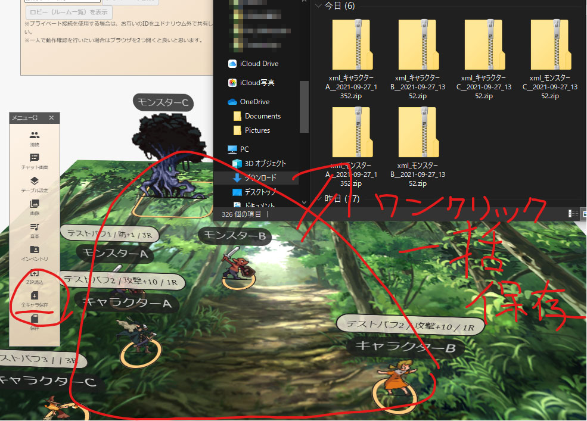
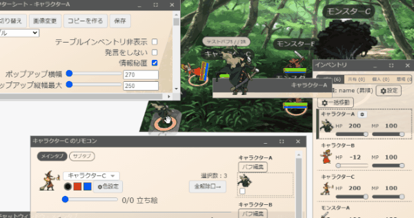
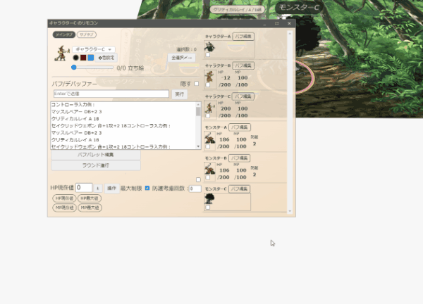
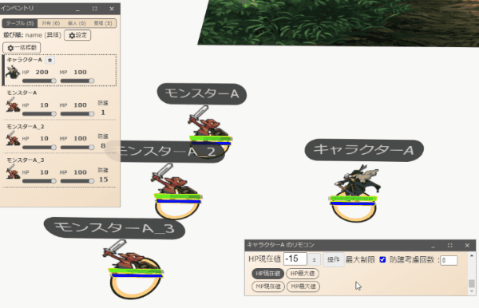
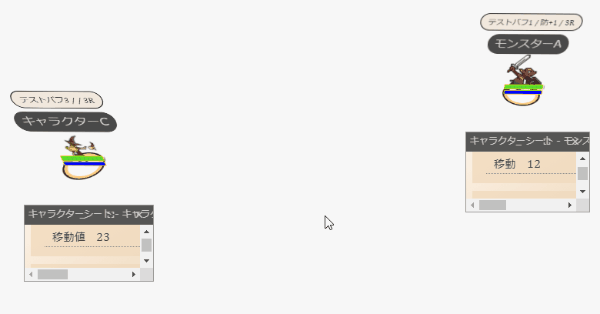

# introduction

ユドナリウムリリィをローカル環境でゴリゴリにソード・ワールド2.5『だけ』で遊び倒すカスタムのプロジェクト。
これリリィさんとこからフォークした所でプルリク送るような内容じゃねぇな？と判断したので完全に別で作成。

・ユドナリウム（Udonarium）はクッソ快適なブラウザベースのボドゲオンセツール。
※本家ユドナリウムの開発範囲は本家に著作権が有って、
分家ユドナリウムリリィの追加範囲は円柱さんかそのソースの作者に著作権が有って、
そのさらに分家のユドナリウムリリィGKの追加範囲は(GitKohei)とそのソースの作者に著作権が有って、
同じようにMITライセンスを引き継ぎます。

:warning:
参加者の要求PCスペックが無駄に跳ね上がる演出をいれてたり
スマホ・タブレットからの参加とか度外視でUIを弄り倒してあるから
もしおま環でまともに動かなくても泣かない。
じっくりねっとりコードを追って何かなおった感出たらプルリクください
:warning:

# installation

分家から引用
> 
> ---------以下本家からの一部抜粋です---------------
> 
> https://github.com/TK11235/udonarium
> 
> ## サーバ設置
> ユーザ自身でWebサーバを用意し、そのサーバにユドナリウムリリィを設置して利用することができます。  
> 以下のファイルをダウンロードして解凍し、Webサーバに配置してください。  
> 

https://まだリリースビルドはないよ/

> 
> #### SkyWay
> このアプリケーションは通信処理にWebRTCを使用しています。  
> WebRTC向けのシグナリングサーバとして[SkyWay](https://webrtc.ecl.ntt.com/)を利用しているため、動作確認のためにSkyWayのAPIキーが必要です。
> 取得したAPIキーの情報は`src/assets/config.yaml`に記述します。
> 
> **開発者向けのソースコードをダウンロードしないように注意して下さい。**
> 1. [SkyWay](https://webrtc.ecl.ntt.com/)のAPIキーを取得し、APIキー情報を`assets/config.yaml`に記述します。
> 1. サーバに配置したユドナリウムの`index.html`にアクセスして動作することを確認してみてください。  
> ユドナリウムリリィはサーバーサイドの処理を持たないので、CGIやデータベースは必要はありません。
> 
> #### そのほか難しいこと
> 本家と同じなので本家の udonarium の説明を参照してください。
> 自力コンパイルするかたへｖ1.02.0より--prodで自動生成される 3rdpartylicenses.txt にソフト内リンクが貼られるようにしてあります。
> つけないと生成されずlicensesへのリンクが切れるのでご注意ください。
> 

# changelog

※とりあえずリポジトリとreadme作ったらもう眠くなったから実際のコードはまたこんどコミットするわ
<dl>
    <dt>Add: 一括保存 gk0.1.0</dt>
        <dd>
            テーブル上のキャラのみを全て単体zipで保存するボタンを追加。あと保存した時の名称形式も何か変えた気がする
             
        </dd>
    <dt><del>Add: メジャー</del></dt>
        <dd>
            <del>メジャーを仮実装したら確定でハングする動作が残っちゃった</del> バグしかねぇ削除だこんなもん
        </dd>
    <dt>Add: HP・MPバー gk0.2.0</dt>
        <dd>
            クッソ見やすいHPとMPを表すよくある横棒状のあれをキャラの足元あたりに追加
             
        </dd>
    <dt>Add: 情報秘匿 gk0.3.0</dt>
        <dd>
            魔物知識判定する前からHPとか色々見えちゃうのがよろしくないのでキャラ詳細情報のド頭にチェックボックスを追加
             ※キャラを中クリックでもトグル可能
             これモンスター名とかも秘匿してもいいんだけど、セッション中に「そこの？？？_Aを攻撃します」って発言しづらいやろから名前は秘匿しない方向で実装中 なんか名案あったらissuにでもコメントくれ
             
        </dd>
    <dt>Remove/Improve: リモコン/ラウンド進行 gk0.3.4</dt>
        <dd>
            全/個バフラウンド減少/削除の4ボタンを使い分ける事がSW2.5ではあんま無いので全バフ減少+0以下削除をまとめて1ボタンに
        </dd>
    <dt>Remove/Improve: チャットログ/ラウンド進行時に消えたバフを表示</dt>
        <dd>
            いつの間にかバフ切れてたンゴが多発するのでラウンド進行時のチャットログをクッソキレイにしてそのラウンドに消えちゃったバフがあればそのキャラ名とバフ名を表示するように
             
        </dd>
    <dt>Improve: リモコン/数値最大値超えないをデフォルト化 gk0.3.4</dt>
        <dd>
            SW2.5でヒールしてHP限界値突破させる事なんて超レアケースだったのでチェックボックスを初期でチェック状態に
        </dd>
    <dt>Fix: リモコン/バフ欄 gk0.3.4</dt>
        <dd>
            なんか伸び悩んでたのでレイアウトを変更。多分これまた変更するし、同じ変更内容をテーブルUIにつっこむべき     
        </dd>
    <dt>Improve: リモコン/操作先はHP現在値をデフォルト化</dt>
        <dd>
            SW2.5でリモコン使って相手の数値いじるなんてほぼHPだし初期でそこをチェック状態に ※したけど、表示上はそう見えない事に留意
        </dd>
    <dt>Add: リモコン/防護点考慮 gk0.3.4</dt>
        <dd>
            いちいち防護点見に行って引き算すんのめんどかったのでチェック先のキャラの防護点を考慮してHP操作する為のチェックボックスを追加
             
        </dd>
    <dt>Add: 距離同心円 gk0.5.1</dt>
        <dd>
            キャラをダブルクリックするとキャラを中心に同心円を出す機能を追加。これで自キャラから各他キャラまでの距離感が明快に
             
        </dd>
    <dt>Add: テーブル/スケール gk0.5.1</dt>
        <dd>
            キャラから出る距離同心円とかの距離基準が変更できたほうが捗るのでテーブルの設定値として追加することに
             ※リアルタイムで同心円のUpdateかけらんないのこれ？重いか？重そう！
        </dd>
    <dt>Improve: カットイン/よく使う末尾のやつ</dt>
    <dd>打撃音とか回避音とかはもう全部初期状態でカットイン作成済みに。ついでにカットイン名が重複してたら作成しないようにしといた</dd>
    <dt>Improve: インベントリ/テーブル上のキャラ探し機能</dt>
    <dd>インベクリックでハイライト出てたけどマウスオーバーでずっとハイライト出るように変更してこのキャラどこいっちゃったの現象を減少（激旨ギャグ</dd>
    <dt>Add: インベントリ/キャラの行動まち？待機状態</dt>
    <dd>SW2.5の戦闘中にあれお前ってこのラウンドもう行動したっけ論争が何度も再燃するせいでセッション時間がクソ伸びるので行動済み状態を追加 ※とりあえずインベントリクリックでトグルできる状態、あとラウンド進行したら全リセするように</dd>
    <dt>なんかほかにも</dt>
    <dd>わりかしいじってる気がする 気づいたら書き直すわ</dd>
</dl>
